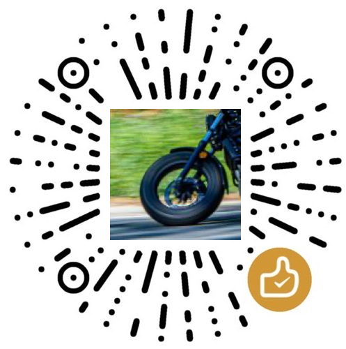

# 骑行摩托

## 简介

摩托车追焦汇总小程序。
目前正在开发中阶段，如有建议或Bug请联系客服或反馈

## 扫码畅玩

|微信小程序码| 赞赏码(觉得不错打个赏😁) |
| :------: |  :------: |
|  |  |

## 版本

### 计划

- 基于大家提出的建议尽快落实 🤗
- 跑山路线可视化

## v1.5.0 2022-06-13

### 🌈 新功能

- 公众号的微信号录入完成后可以预览二维码进行验证是否正确
- 地图搜索完地点后可以自由选点
- 「骑行摩托」公众号上线，公众号中提供小程序入口

### ❌ 修复问题

- 不同摄影师在同一地点上传，导致覆盖的问题

## v1.4.0 2022-06-11

### 🌈 新功能

- 地图标记点点聚合

### ❌ 修复问题

